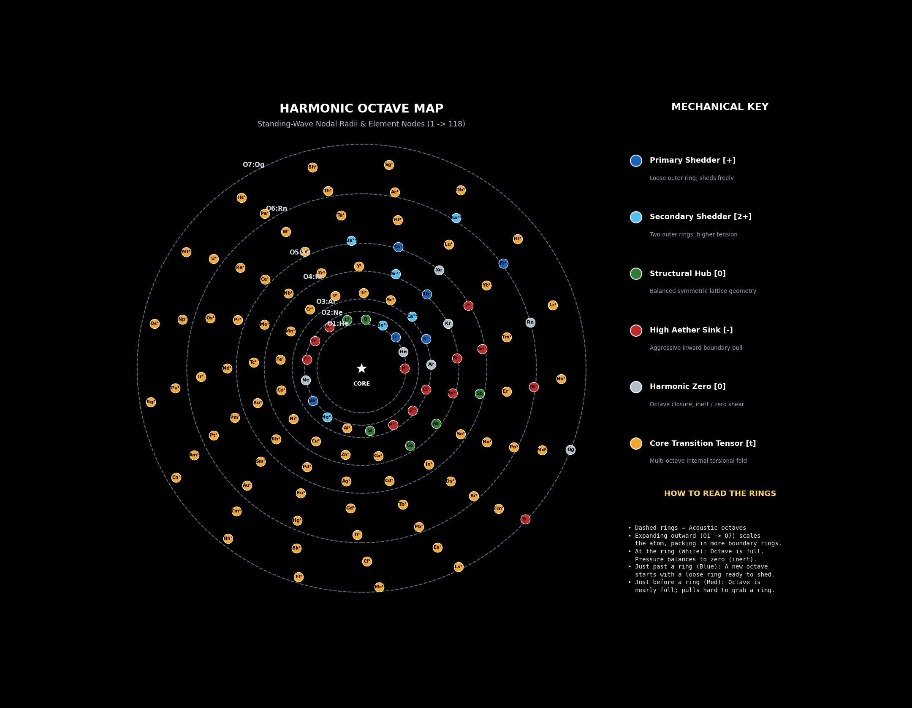

# 02: Atomic Harmonics & Vortex Chemistry

This directory houses the atomic-structure and chemical-interaction framework for **Scalar Relaxation Cosmology (SRC)**. 

Mainstream physics relies on empirical patches, probabilistic wavefunctions, and a 17-particle zoo because it treats space as empty and atoms as point-mass assemblies. This framework replaces that complexity with a deterministic, fluid-dynamic architecture.

---

## The Working Harmonic Map
Below is the mathematically accurate, fixed-step structural map of all 118 elements. Octave closure rings (acoustic nodal nulls) are marked and labeled (O1 through O7), and elements are color-coded strictly by our **6 Mechanical Archetypes**.

*(Download the high-resolution vector version: [harmonic_spiral_map.pdf](assets/harmonic_spiral_map.pdf))*

---

## Document Index
- [01: Nuclear Geometry & Forces](01-nuclear-geometry.md) — Double-toroids, Grassmannians ($Gr(k,n)$), and unified forces.
- [02: Algorithmic Reaction Engine](02-reaction-engine.md) — Shear-delta ($\Delta \tau$) topological matching.
- [03: The Harmonic Periodic System](03-harmonic-table.md) — Native 3D Globe and 2D Map architecture.
- [04: Element Mapping & Octave Scaling](04-element-mapping.md) — Concrete mapping of Hydrogen, Helium, and Period 2 transitions.
- [05: Interaction Archetypes](05-interaction-archetypes.md) — The fundamental classes of chemical behavior (covalent, ionic, noble).
- [Element Octave & Boundary Shell Reference](element-octave-reference.md) — Complete 118-element lookup guide for atomic numbers, names, and acoustic boundary capacities.
- [Legacy Translation Matrix (Rosetta Stone)](rosetta-stone.md) — Standard Model to Aetheric equivalents.
- [First-Principles Reaction Engine](scripts/reaction_engine.py) — Continuous field reaction model running purely on tuple mechanics ($f, \tau, \Delta P$).

