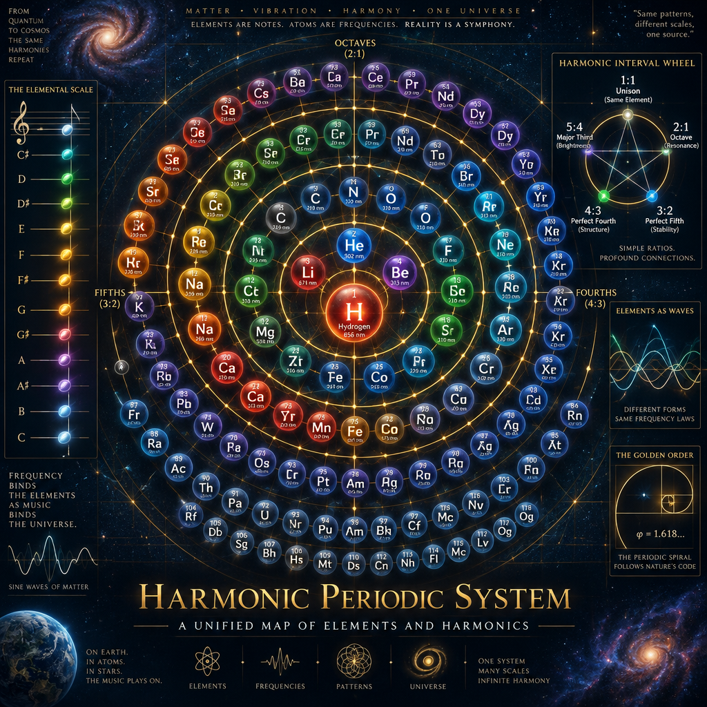

# Scalar Relaxation Cosmology (SRC)

A speculative cosmological and physical framework interpreting planetary history, atomic structure, and fundamental forces through plasma electrodynamics, quantum-mechanical collective states, and dynamic aether fluid mechanics.

---

## 🔬 Featured Module: Atomic Harmonics & Vortex Chemistry
We have replaced the probabilistic Standard Model with a deterministic, fluid-dynamic architecture. Atoms are modeled as nested double-toroids, and chemical reactions run via topological phase-locking.

👉 **Explore the full module:** [`atomic-harmonics/README.md`](atomic-harmonics/README.md)
 

### Key Sub-Documents:
- [01: Nuclear Geometry & Forces](atomic-harmonics/01-nuclear-geometry.md) — Double-toroids, Grassmannians ($Gr(k,n)$), and the unification of strong/weak forces via harmonics.
- [02: Algorithmic Reaction Engine](atomic-harmonics/02-reaction-engine.md) — Replacing DFT and quantum approximations with shear-delta ($\Delta \tau$) topological matching.
- [03: The Harmonic Periodic System](atomic-harmonics/03-harmonic-table.md) — The native 3D Globe and 2D Map architecture replacing the flat grid.
- [Rosetta Stone (Legacy Translation)](atomic-harmonics/rosetta-stone.md) — Mapping Standard Model terms to aetheric equivalents.

---
*(Additional SRC research modules, Venus probe concepts, and cosmological frameworks will be cataloged here as development continues.)*
